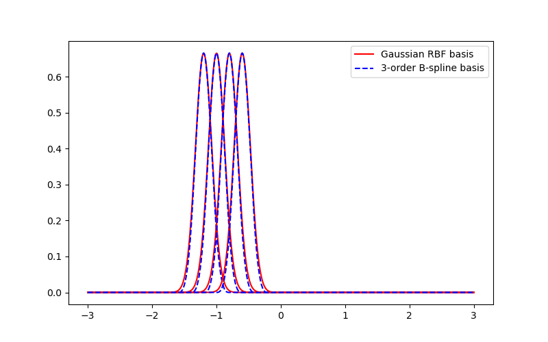

# Experemints with FastKAN for benchmarking

This repository contains a very fast implementation of Kolmogorov-Arnold Network (KAN). The forward time of FaskKAN is 3.33x faster than [efficient KAN](https://github.com/Blealtan/efficient-kan), and the implementation is a LOT easier.

The original implementation of KAN is [pykan](https://github.com/KindXiaoming/pykan).
The original implementation of Fast-KAN is [fast-kan](https://github.com/ZiyaoLi/fast-kan)

FastKAN:

1. From [fast-kan]:

Used Gaussian Radial Basis Functions to approximate the B-spline basis, which is the bottleneck of KAN and efficient KAN:

$$b_{i}(u)=\exp\left(-\left(\frac{u-u_i}{h}\right)^2\right)$$

The rationale of doing so is that these RBF functions well approximate the B-spline basis (up to a linear transformation). and are very easy to calculate (as long as the grids are uniform). Results are shown in the figure below (code in [notebook](draw_spline_basis.ipynb)). 

The idea is to experiment with other bases or exponent values. special.expit seems promising:

$$b_{i}(u)=\frac{1}{\exp\left(-\left(\frac{u-u_i}{h}\right)^2\right)+1}$$

2. Used LayerNorm to scale inputs to the range of spline grids, so there is no need to adjust the grids.

3. From [fast-kan]:

FastKAN is 3.33x compared with efficient_kan in forward speed, based on @ZiyaoLi(https://github.com/ZiyaoLi)

The benchmarking I tested inspired from [KAN-benchmarking](https://github.com/Jerry-Master/KAN-benchmarking),
indicate that it may be even Faster(executed on a NVIDIA GeForce RTX3050 Ti 4G and an AMD Ryzen 7 6800H):

|                 | forward	 | backward	 | forward	 | backward	 | num params	 | num trainable params	 |
|-----------------|----------|-----------|-----------|-----------|-----------|-----------|
| fastkan-gpu     | 2.37 ms	 | 4.47 ms	 | 0.14 GB	 | 0.14 GB	 | 300021	 | 300005	 |
| mlp-gpu     | 1.06 ms	 | 1.48 ms	 | 0.07 GB	 | 0.10 GB	 | 300001	 | 300001	 |
| effkan-gpu     | 11.83 ms	 | 22.05 ms	 | 0.36 GB	 | 0.36 GB	 | 300000	 | 300000	 |

FastKAN can be after small modifications 4.99x faster than efficient_kan and 2.23 slower from MLP in forward speed

FastKAN can be after small modifications 4.93x faster than efficient_kan and 3.02 slower from MLP in backward speed

FastKAN can be after small modifications 2.57x smaller than efficient_kan and 2 bigger from MLP in forbward memory

FastKAN can be after small modifications 2.57x smaller than efficient_kan and 1.4 bigger from MLP in backward memory
